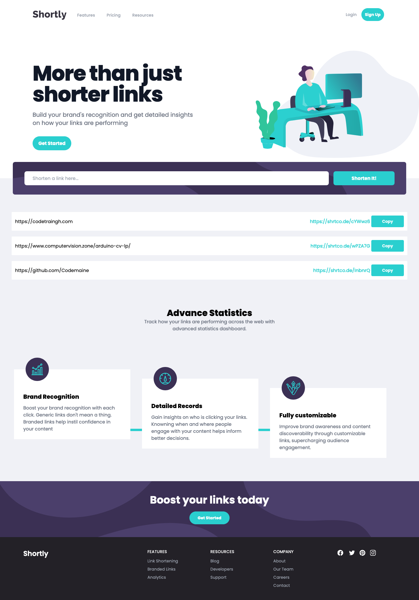
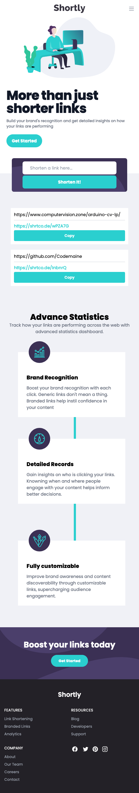

# Shortly URL shortening API Challenge solution


## Table of contents

- [Overview](#overview)
  - [The challenge](#the-challenge)
  - [Screenshot](#screenshot)
  - [Links](#links)
- [My process](#my-process)
  - [Built with](#built-with)
  - [What I learned](#what-i-learned)
  - [Continued development](#continued-development)
  - [Useful resources](#useful-resources)
- [Author](#author)

## Overview

### The challenge

Users should be able to:

- View the optimal layout for the site depending on their device's screen size
- Shorten any valid URL
- See a list of their shortened links, even after refreshing the browser
- Copy the shortened link to their clipboard in a single click
- Receive an error message when the `form` is submitted if:
  - The `input` field is empty

### Screenshot





### Links

- CSS Framework: [https://taillwindcss.com](https://tailwindcss.com)
- Live Site URL: [https://codetrain-shortly-challenge.vercel.app](https://codetrain-shortly-challenge.vercel.app)

## My process

### Built with

- Semantic HTML5 markup
- Custom CSS Framework
- Flexbox
- CSS Grid

### What I learned

This project allowed me to recap and even learn some new code.

Here are some new code snippets I learnt:

```html
<ul id="todos"></ul>

    <form> 
        <input name="todo" type="text">
        <input type="submit" value="Add Todo">
    </form>
```
```js
// Get DOM elements
        const form  = document.querySelector('form');
        const input = document.querySelector("[name='todo']");
        const todoList = document.getElementById('todos');

         // Side Effects / Lifecycle
    
        const existingTodos = JSON.parse(localStorage.getItem('todos')) || [];

        const todoData = [];
        
        existingTodos.forEach(todo => {
            addTodo(todo);
        });


        function addTodo(todoText) {
            todoData.push(todoText);
            const li = document.createElement('li')
            li.innerHTML = todoText;
            todoList.appendChild(li);
            localStorage.setItem('todos', JSON.stringify(todoData));
            input.value = ''
        }

        // Events
        form.onsubmit = (event) => {
            event.preventDefault();
            addTodo(input.value);
        }

```

### Continued development

I wish to continue using tailwindcss in my future projects. I really like the design and it makes any UI look fantastic.

### Useful resources

- [TaillwindCSS](https://www.tailwindcss.com) - This helped me for the design of the website. I really liked this pattern and will use it going forward.

## Author

- Website - [Jermaine Antwi - Github](https://www.github.com/Codemaine)
